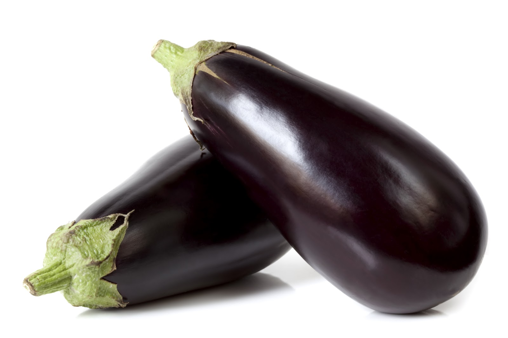

# Berenjena

Morada, de piel brillante y textura firme, la berenjena es una de las hortalizas más versátiles y ricas a la que podemos recurrir. Aunque la conocemos gracias a los árabes (de quienes conservamos recetas como las berenjenas fritas con miel), la berenjena es originaria de India, donde existen múltiples variedades y es un alimento muy consumido.

