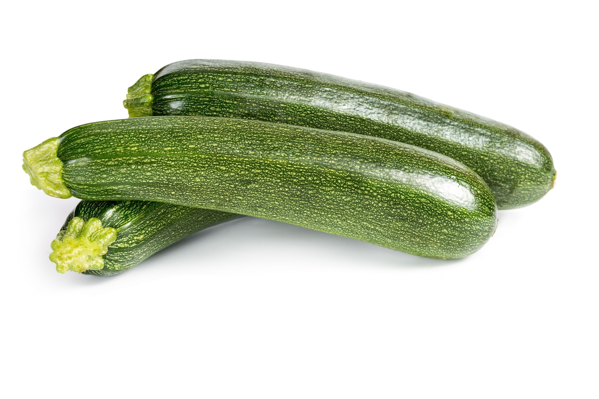

# Calabacin

El calabacín es una hortaliza estrella, que no falta en el menú de ningún hogar, ¡o por lo menos no debería faltar! Es que las propiedades del calabacín lo convierten en un aliado de nuestra salud: tiene pocas calorías, fibra, aporta una buena cantidad de vitaminas y minerales y además es antioxidante.

Hola