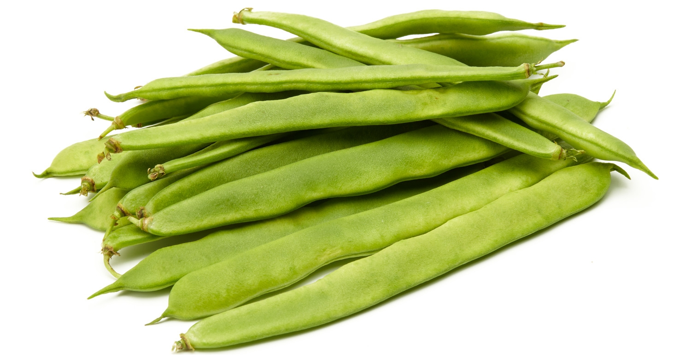

# Judia

Las legumbres constituyen un grupo de alimentos muy homogéneo, desarrollados a partir del gineceo, de un solo carpelo y que se abre tanto por la sutura ventral como por el nervio dorsal, en dos valvas y con las semillas en una hilera ventral. 

