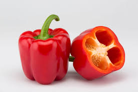

# Pimiento

El pimiento es una hortaliza de forma, tamaño y color variable. Puede ser verde, rojo, amarillo, naranja e incluso ¡negro!. Su sabor puede ser dulce o picante y se consume en fresco, en conserva, etc.

